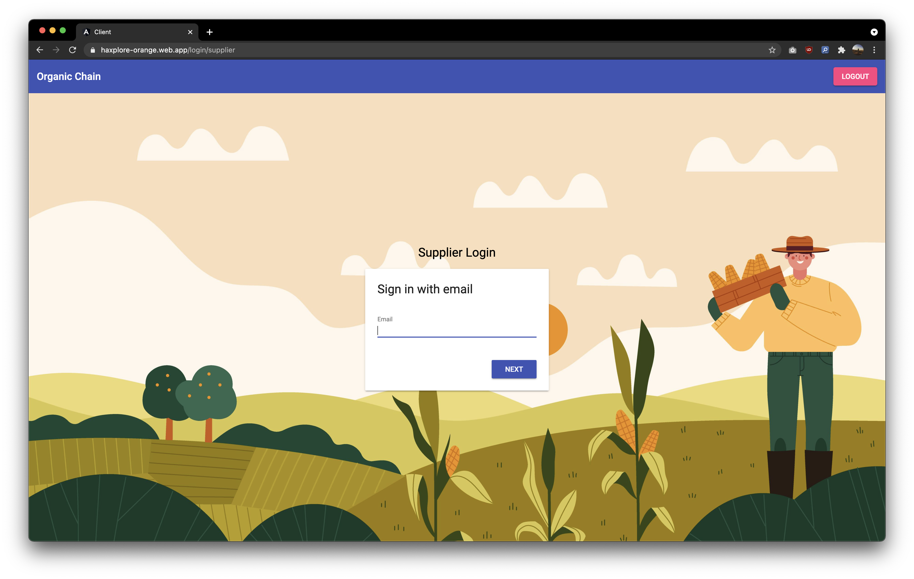
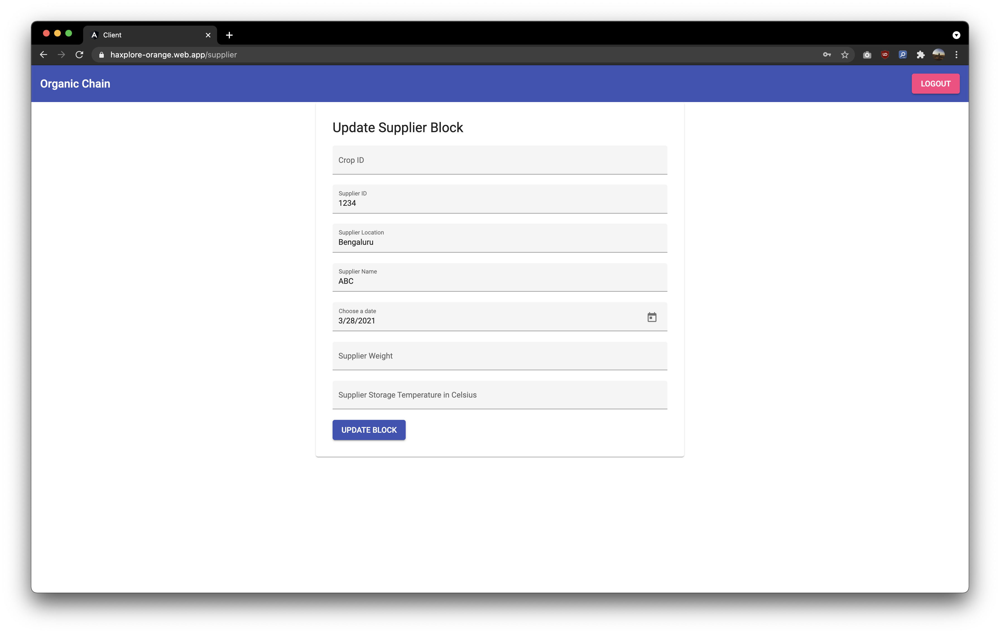
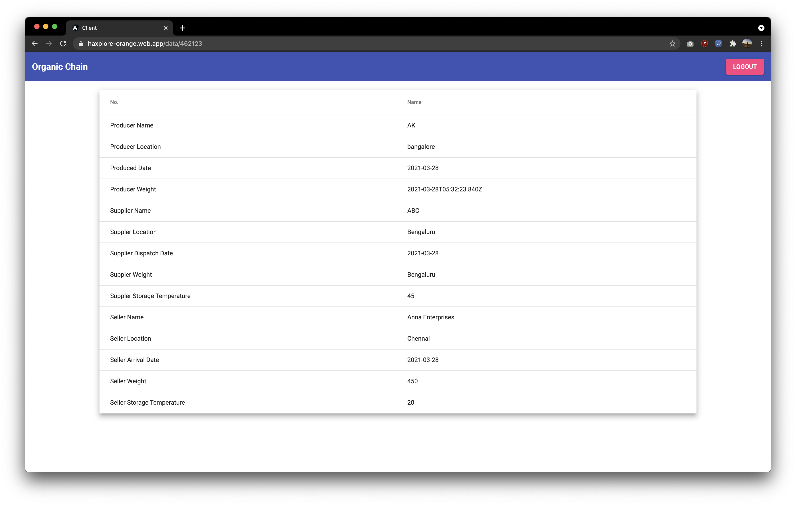
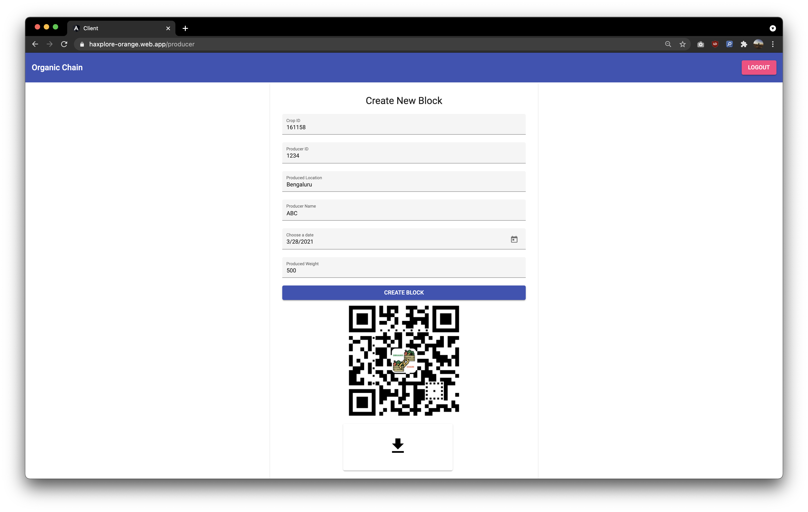
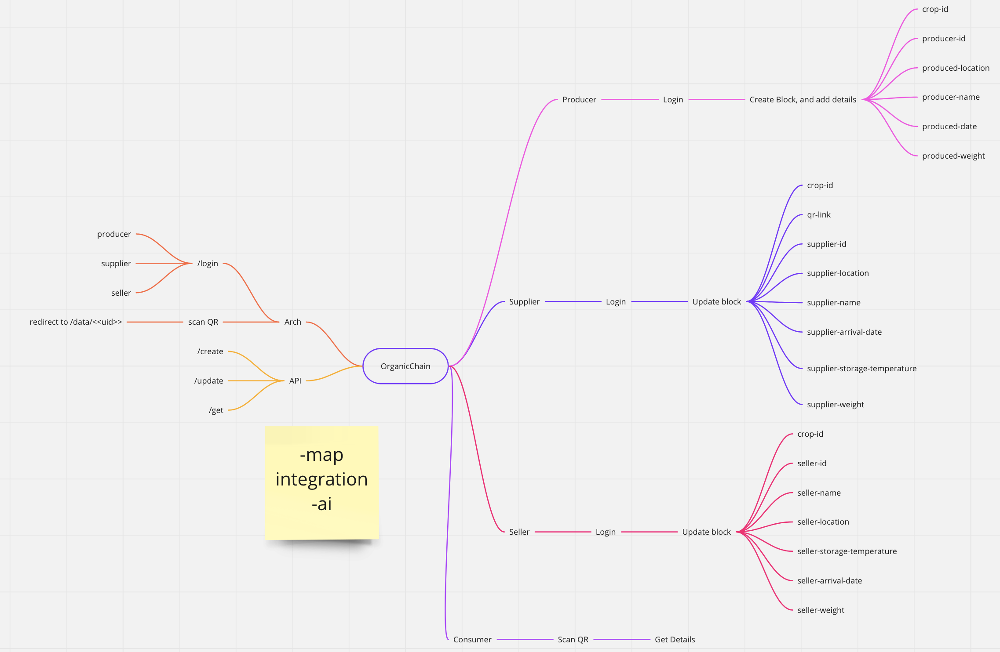

# HaXplore 2.0 - Submission Report Format

This is the official code repository for _Orange_ . This _BlockChain based food traceability app_ was developed during HaXplore 2.0, 
the online hackathon conducted by Codefest, the annual departmental fest of Computer Science department, IIT BHU Varanasi.

### _Team Name_

* [_Aayush_](https://github.com/NaikAayush/)
* [_Samyak S_](https://github.com/Samyak2/)

### **OrganicChain**

#### Overview

_Seamlessly share Organic Food data across with high transparancy._

Imagine a future where you walk into a store and scan a QR code of a food packet, and all the information of that packet is visible, like, where and when it was grown, packed, shipped, storage temperature. This is possible with OrganicChain, with suppliers, producers, sellers and consumers on one platform.

Organic Food is becoming increasingly popular these days, but how do we ensure that the ingredients used in it have been produced where the manufacturer says it has been produced, that they have been stored at ideal temperatures and that this data has not been tampered with.

OganicChain does exactly this.

OrganicChain connects producers, suppliers, sellers *and* consumers to automate the process of supply chain tracking. This increases consumer's trust in the system to ensure organic foods are always safe and of the best quality.

#### Simplicity

For producer, suppliers and sellers the process is the same as data entry into a system which is already begin undertaken in most establishments. On the producer's side, there is an additional step of printing and applying the QR code to the ingredient.

For the consumer, a **QR code** will be displayed on the food item which they simply have to scan using a QR code scanner (built into most phones these days) and OrganicChain will display **all details of the producer, supplier and seller** along with **item weight, storage temperature and exact timestamp of dispatch and arrival** at each location.

The consumer *does not need to have any special app installed*, they only have to scan the QR code and click on the link.

#### Security

The consumer needs to ensure that the data is not tampered with at any point in the supply chain. The change log needs to reflect which part of the data was changed and store the previous version too. OrganicChain does this by using a blockchain network to store all data.
In summary, OrganicChain stores all versions of the data thereby ensuring that it cannot be tampered with.

#### BlockChain

All of the data in OrganicChain is stored on a Hyperledger Composer based blockchain network. Hyperledger Composer has a peer-to-peer network where the peers store data and reach a consensus to ensure the data is consistent. Since it is a blockchain, whenever some data is updated, the previous copy of it is also stored. Thus, this gives full transparency of the data. We have deployed Hyperledger Composer on a VM on GCP.

#### Machine Learning

Sometimes, the data given by producer, supplier or seller might be incomplete. It will be useful for the consumer to know if the item may have gone bad. For this, we can use
a classification model to predict whether an item is edible or not. The input to this model will be the timestamps of dispatch and arrival, the storage temperatures and the item weights at each location. We have built a prototype based on a limited set of data (the code is under `ai` folder).

#### Technology used

* HyperLedger Composer: to implement the BlockChain
* Angular: for the frontend
* Node.js: backend APIs (using express.js)
* Firebase: for authentication and storage
* GCP VM: to deploy hyperledger (AWS was not used since we did not have credits)
* `scikit-learn`: to train the ML model

#### Features

 - [x] Hyperledger Blockchain for data
 - [x] Producer login
 - [x] Producer create new item
 - [x] QR Code gen
 - [x] Supplier login
 - [x] Supplier update existing item
 - [x] Seller login
 - [x] Seller update existing item
 - [x] QR code scanning to get all data (consumer)

#### System Architecture

 - Hyperledger Composer: on a VM on GCP
 - Backend API server: implemented in `express.js` and hosted as a Firebase function. This forwards queries to the blockchain (hyperledger composer) API.
 - Storage: used Firebase Storage (based on GCP Cloud Storage). This stores the QR codes.
 - Frontend: implemented in Angular and hosted on Firebase hosting. Central part of the application which renders the UI and calls appropriate backend APIs.
 - Machine Learning: not integrated with the rest of the system, we could only do it in a separate Google Colab notebook for now.

#### Screenshots/Demo Video

_Add some screens and a demo_

#### Usage

_Tell in steps how can we setup your application. Also mention all relevant requirements and links._
* First step is to run npm -i to make sure to install all the dependencies.
* The Front End Angular app is in the client folder, and can be run using ng serve.
* The Back End Node.js code is under the server folder, and npm run is used to run it.
* The App consists of 4 interfaces.
1. Producer - Where the Food Producer creates the block on the blockchain with starter information.
2. Supplier - The Supplier updates the block with further information such as date and storage temperature.
3. Seller - Further updates in regards to the storage area, temperature, and date.
4. Consumer - The dashboard to look at all the transparent data, to completely know about the origin of the Food.

* All our services communicate via APIs, for scalability and simplicity

#### Tracks used

_Amazon Web Services Track_

#### AWS Services Used

We did not use AWS services as we did not have credits to use them.

